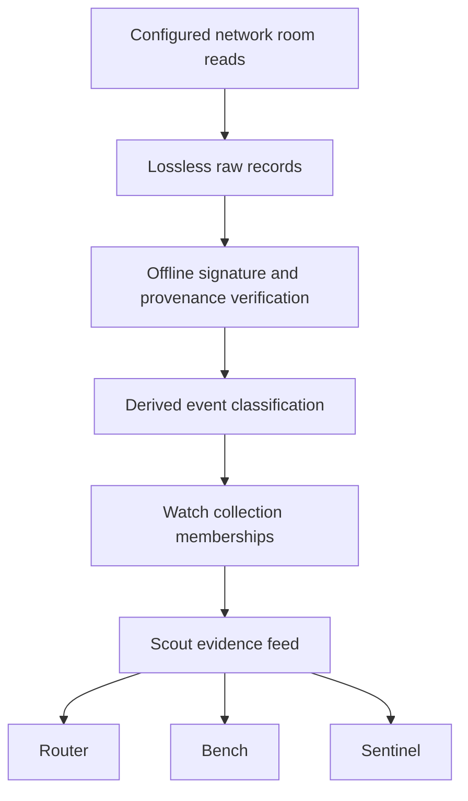

# Scout evidence feed v1

Scout is the network observation and evidence-ingestion layer for the FLOP agent
stack. Router, Bench, and Sentinel should consume this local feed for ecosystem
evidence. They should not independently scrape Technocore for that purpose.
Changing those consumers is outside this repository.



“Signature verification proves authorship/integrity, not correctness, capability,
independence, or reputation.”

## Raw evidence and signature semantics

`raw_network_records` is append-only. SQLite triggers prevent updates, deletes,
and replacement of an existing raw identity. Records with bad or missing
signatures, malformed envelopes, non-object entries, and unknown text are retained.
There is no automatic retention or pruning.

For valid strings, `raw_text` is the exact decoded network string. Its hash is
SHA-256 of its UTF-8 bytes, without trimming, Unicode normalization, JSON
reformatting, or single-line normalization. JSON-looking text remains a string;
its embedded key order and escapes are not changed. Verification uses
`room|nonce|text` as UTF-8, with the returned nonce digits. Integer nonces never
pass through float. A string nonce preserves its digits, including leading zeros;
the original envelope also retains whether the nonce was a string or integer.
The legacy INTEGER cache cannot represent values above SQLite's signed 64-bit
range; these still appear intact in the raw store and event feed.

Decoded UTF-8 text is sufficient for Technocore's signature semantics. HTTP JSON
escaping and envelope whitespace are not signed. `raw_record_json` is explicitly
a reconstruction of the decoded response object, not an assertion of exact HTTP
transport bytes. `transport_metadata_json` records that distinction, the request
endpoint, and available generation, Content-Type, Date, and ETag headers.
`source_endpoint` is the actual request URL including pagination parameters.

For a non-string or invalid-UTF8 payload, `raw_text` is NULL; the complete decoded
record survives in ASCII-escaped `raw_record_json`. Its hash uses that JSON
instead, with `hash_basis=raw_record_json_ascii` in transport metadata. This is
an explicit malformed-record fallback, not an invented signed text.

The immutable identity hashes source, room, authoritative response generation,
reported legacy generation, and the full decoded envelope. Envelope key order is
sorted only for identity computation, never inside message strings. Retrieval
time and pagination URL are excluded so replaying a record is idempotent. An
altered signature, timestamp, sender, nonce, or payload produces a separate record.
Same-position payload conflicts are reported by integrity checks. Repeated
retrievals use a separate append-only observation log and suppression counter.

`generation` comes from the configured room response or its generation header;
it is server provenance, not part of the signature. Historical migration stores
old generation values in `reported_generation`, with `generation=NULL`. Conflicting
body/header generations are retained but do not advance the cursor. A server
retention gap detected via `first_seq` also blocks cursor advancement.

Signed `/r/kibble` records use the same room-evidence path. Existing Kibble board
reconciliation remains a separate reconstructed convenience cache; it cannot
replace or update raw room evidence. The v1 feed exposes room events, not board
reconstruction as signed events.

References checked for this change: [Technocore source](https://github.com/flop-labs/technocore-chat),
[API reference](https://technocore.chat/llms.txt), [signature semantics](https://technocore.chat/auth.md),
and [patterns](https://technocore.chat/patterns.md). No room-provided links are followed.

## Derived events and compatibility indexes

`observed_events` contains an AUTOINCREMENT `event_id`, the exact `raw_record_id`
and `raw_text_sha256`, source/room/sequence/sender/time, parser and classification
versions, classification reason, signature and parse statuses, structured content,
and duplicate metadata. A composite foreign key enforces both raw identity and
hash. No LLM is involved.

The parser recognizes explicitly declared JSON message types and conservative
anchored phrases for identity presence, promotion, work requests, acceptance,
results, verification results, and external-rail claims. It recognizes the existing
`tclk1` frame types and versioned Kibble event types. Official announcements are
classified only as self-declared announcements; no room name or sender claim
establishes official authority. Unknown content stays `UNCLASSIFIED`. Malformed
or unverifiable content becomes `MALFORMED_UNVERIFIABLE_EVENT`. Every structured
payload states `claim_only=true` and `correctness_verified=false`.

Signature statuses are `VERIFIED_OFFLINE`, `FAILED`, `MISSING`, or `UNSUPPORTED`.
A TCLK frame sender mismatch is tracked independently of a valid transport
signature. No classification executes or accepts a settlement action.

Existing `messages`, `evidence_records`, `tclk_frames`, `kibble_events`, and
`opportunities`, validation response candidates, and stored TCLK capability hints
remain compatibility indexes. `compatibility_evidence_links`
connects their retained source text to raw identity and hash. Old caches may
collapse generations or conflicting positions; the raw store and new feed retain
both. Aggregated job and interaction views are not the consumer event feed.
Consumers must use `observed_events`, not treat old summary rows as raw evidence.

Exact reposts share a content hash. Re-reading the same immutable identity adds
no event. Promotional templates may mask only explicit timestamp, nonce, sequence,
UUID, and job-ID fields. Normalization is derived-only. Work results never undergo
template masking. Amounts, capabilities, substantive prose, and other fields are
preserved. Similarity never proves identity, coordination, spam intent, or truth.
Duplicate kind is relative to evidence present at first parsing; the first member
remains `UNIQUE`. Exact repost groups use `text:<hash>`; promotional template
families use `normalized_template_hash` / `template:<hash>`.

## Watch collections

The documented defaults are in `watch_collections.default.json` and mirrored in
`scout_evidence.DEFAULT_COLLECTIONS`. A local
`$FLOP_SCOUT_STATE_DIR/watch_collections.json` (normally
`~/.flop_scout/watch_collections.json`) overrides collections by name. No config
file is automatically written to production state.

Configured rooms must be literal valid Technocore room/mailbox names, never URLs
or commands. Default groups cover faucet, kibble, consensus_layer, tclk,
a2a_mesh_router, and competitor_projects (`flop-evidence-scout`). External work,
registry announcements, and official announcements start with no invented sources.
Existing lobby, technocore, mailbox, and validation-watch rooms continue to work.

A raw record can belong to several collections without duplication. Configuration
is synchronized on writer open only when its hash changes. Membership records
preserve historical association when a collection is subsequently disabled;
disabling removes that collection's polling contribution, not past evidence.
Rooms also required by existing service/validation configuration remain watched.
Newly configured room membership is backfilled across stored evidence.

## Local interface and consumer checkpoints

All examples below are local database reads unless explicitly labelled writer.
The output schema is `flop-scout-evidence/v1`.

```sh
python flop_scout.py service status --db /path/to/observer.sqlite
python flop_scout.py evidence verify-integrity --db /path/to/observer.sqlite
python flop_scout.py evidence feed --db /path/to/observer.sqlite --since-id 12345 --format jsonl
python flop_scout.py evidence export --db /path/to/observer.sqlite \
  --collection kibble --classification KIBBLE_RESULT --since-id 12345 \
  --output /path/to/new-export.jsonl
python flop_scout.py report daily --db /path/to/observer.sqlite --date 2026-09-05 --json
python flop_scout.py evidence soak-status --db /path/to/observer.sqlite
```

Feed records include schema, local event ID, raw ID/hash, classification and
reason/version, source/endpoint, room, generation/reported generation, sequence,
network timestamp, retrieval/parse times, sender, signature status, parse status,
structured event, watch collections, completeness/legacy flags, and duplicate
metadata. `operator_relationship` is currently NULL: remote assertions do not
establish operator independence or affiliation. Raw signatures and exact bodies
can be resolved locally from `raw_network_records` by `raw_record_id`.

JSONL streams in event-ID order without loading the entire export into memory.
`--since-id` is exclusive. IDs are stable, increasing within this database, and
may contain gaps. They are not Technocore sequence numbers. `--since-seq` is an
optional secondary filter only; sequences are room/generation-local and must not
be used as a global consumer checkpoint. Outputs create new files exclusively,
so accidental overwrites of a database or prior export fail.

Each consumer owns its own checkpoint in its own state directory, for example:

```json
{"consumer_name":"router","last_event_id":12345,"updated_at":"2026-09-05T12:00:00Z"}
```

Consume in ID order, commit consumer results, then atomically replace that
consumer's checkpoint file (write a temporary file, fsync, rename). Prefer a
consumer-local SQLite transaction containing both results and checkpoint.
Deduplicate on `event_id` if a crash occurs after processing and before checkpoint
advancement. Router, Bench, and Sentinel checkpoints are independent. Scout has
no global consumed flag and grants consumers no raw-write API. Consumers should
open SQLite using `mode=ro`; enforce OS file permissions for separate users.
Checkpoint scope is the same database lineage; replacing a database requires an
explicit consumer reset. Repairing a missing event assigns a new ID above the
existing high-water mark, so incremental consumers see it.

## Restart, migration, and concurrency

Writers enable WAL, a five-second busy timeout, and foreign keys. Each raw page
and its primary events commit before compatibility parsing and cursor advancement.
Cursor sequence, generation, and continuity update in one transaction. A crash
between those transactions safely replays the durable page. A raw insert and its
event normally share a transaction; the explicit `evidence repair` writer can
recover missing events in older/interrupted data. Cursor checks require every
returned page member, including malformed entries, to have been persisted.

Polling remains bounded at 200 records per page and ten pages per room by default.
Exhausting the budget reports `CATCHING_UP` with `backlog_remaining=true`. Failed
reads retain the cursor. Generation changes restart from zero in the new epoch.
The server's latest sequence is never used as a replacement for stored evidence.

Reader connections use `mode=ro`, `query_only=ON`, and a busy timeout. Status,
report, feed, export, and integrity commands do not initialize schema, import local
history, read identity files, or call the network. Missing/old schemas give an
explicit unavailable/migration-required result. Integrity scans are deliberately
more expensive than status. Reports use retrieval date in UTC, and first-seen
means first seen in this Scout database, not first-ever network appearance.
Daily output is structured JSON, including useful-work counts, malformed and
signature failures, DID mismatches, conflicts, TCLK observations, all collection
changes, duplicate activity, and scoped safety counters.

Migration runs only in a writer/init path and is version-gated, idempotent, and
transactional for the new evidence schema and historical import. It leaves
existing source tables intact. Historical data is `legacy_record=1`,
`raw_completeness=PARTIAL`; missing endpoints/signatures are not invented. New
network records are `COMPLETE` for what was captured, including malformed records;
this does not mean their provenance verifies. Locally supplied data without an
endpoint is `PARTIAL`.

Before a later production rollout, take a consistent SQLite backup using the
SQLite backup API (not a bare copy of an active WAL database), test migration on
that backup, run integrity verification, and assess disk space and migration time.
The initial import can be substantial and holds a writer transaction. Schedule
production migration deliberately. This coding task neither migrates production
nor changes/restarts launchd. An explicit local migration uses:

```sh
python flop_scout.py evidence init --db /path/to/copied-observer.sqlite
python flop_scout.py evidence verify-integrity --db /path/to/copied-observer.sqlite
# Only if integrity reports missing events:
python flop_scout.py evidence repair --db /path/to/copied-observer.sqlite
```

No raw evidence is pruned. Status reports database and WAL sizes plus record counts.
Future archival must preserve raw IDs/hashes and consumer cursor lineage; no
lossy archival or automatic deletion is implemented.

## Safety and a future 24-hour soak

Observation has no wallet, faucet claim, Kibble claim, or settlement implementation.
Observation entry points reject attempts to unlock Scout's private key or invoke
the signed-write helper. Room HTTP reads disable redirects. Remote strings,
including URLs, shell commands, and instructions to reveal secrets, stay inert.
The existing human-approved publishing commands remain separate and require
`--yes`; they are not called by the observer.

Safety counters cover observation paths since migration: network writes, URL
follows, wallet access, faucet claims, TCLK actions, Kibble claims, and private-key
access. All remain zero. They are not a host-wide audit or claims about unrelated
processes. Report/feed/status perform zero network reads. Tests patch network and
key access to fail and hold a live SQLite write transaction while readers run.

The soak has NOT been started. For a future approved run, choose a dedicated state
directory and this worktree's interpreter. Do not start a second worker against
the production database. No `init` identity command is needed for observation.
`evidence init` initializes only the database, never a DID or key.

```sh
export FLOP_SCOUT_STATE_DIR=/path/to/dedicated-soak-state
python flop_scout.py evidence init
# Run later, under operator supervision or an approved scheduler:
python flop_scout.py service-poll
python flop_scout.py evidence soak-status
python flop_scout.py report daily --json
python flop_scout.py evidence verify-integrity
```

For a future timed run (not executed by this change):

```sh
start=$(date +%s)
end=$((start + 86400))
while [ "$(date +%s)" -lt "$end" ]; do
  python flop_scout.py service-poll >> "$FLOP_SCOUT_STATE_DIR/soak.log" 2>&1
  sleep 30
done
python flop_scout.py evidence soak-status
python flop_scout.py report daily --json
python flop_scout.py evidence verify-integrity
```

Persisted soak metrics count per-room poll cycles, including successful, failed,
and incomplete cycles, read failures and recoveries, records ingested, duplicate
suppressions, regressions, database errors, and start/elapsed time. Elapsed time
includes downtime; successful uninterrupted 24-hour operation must also be
confirmed from scheduler/log timestamps. A database-error metric is best-effort
if SQLite itself cannot accept writes. Read failures include stored error details
where available; malformed top-level HTTP/JSON responses do not advance cursors.
The server's ephemeral history prevents a guarantee of recovering messages it
removed before Scout read them. The lossless guarantee applies to captured
records. Formal soak acceptance additionally requires restart/replay checks,
zero forbidden actions, successful daily report, and zero integrity errors.
